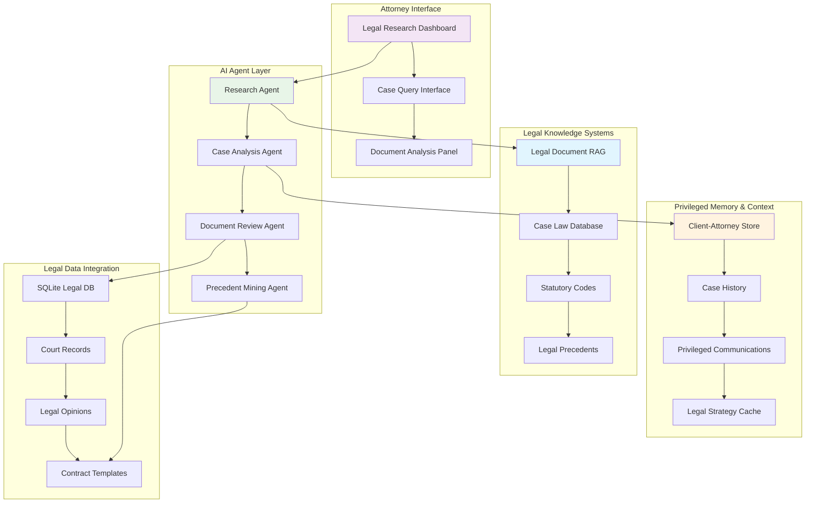
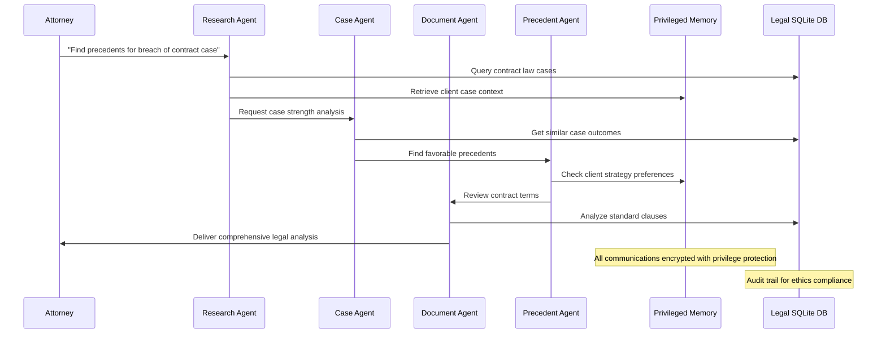
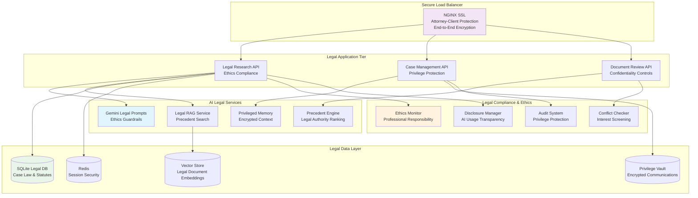

# Legal AI Pod: Case Intelligence System
## ⚖️ Project Overview - Building the Future of Legal Research

**Mission**: Create an AI-powered legal research platform combining the latest legal AI trends with attorney-client privilege protection.

**Industry Context**: 79% of legal professionals use AI, with 55% of firms embracing AI for legal research. Legal AI market valued at $1.45B in 2024, projected to reach $3.90B by 2030.

---

## 🎯 Learning Objectives

By the end of 4 hours, each pair will have built and deployed:
- ✅ **Multi-agent legal research system** with case law analysis
- ✅ **RAG-powered legal knowledge platform** with precedent retrieval
- ✅ **Attorney-client privileged conversations** with secure context management
- ✅ **Production deployment** with legal ethics compliance and audit trails

---

## 🏗️ System Architecture



---

## 👥 User Stories & Success Criteria

### ⚖️ As an Attorney
| User Story | Acceptance Criteria | Technical Implementation |
|------------|-------------------|-------------------------|
| **Legal Research** | "I can query case law and statutes in natural language and get comprehensive analysis with citations" | Multi-agent research with RAG retrieval from legal databases |
| **Case Preparation** | "I receive detailed case analysis with relevant precedents and strategic recommendations" | Case analysis agent with precedent matching + strategy generation |
| **Document Review** | "I can analyze contracts and legal documents for risks, obligations, and opportunities" | Document review agent with legal entity extraction + risk assessment |
| **Precedent Discovery** | "I can find similar cases and favorable precedents to strengthen my arguments" | Precedent mining with vector similarity + legal reasoning |

### 👤 As a Client
| User Story | Acceptance Criteria | Technical Implementation |
|------------|-------------------|-------------------------|
| **Legal Guidance** | "I can discuss my case confidentially and get informed legal advice" | Privileged conversation system with encryption + attorney-client protection |
| **Case Understanding** | "I receive clear explanations of legal issues and potential outcomes" | Plain-language legal explanations + case probability analysis |
| **Document Clarity** | "I understand contracts and legal documents in terms I can comprehend" | Legal document summarization + plain-English translation |

### 🏛️ As a Bar Association
| User Story | Acceptance Criteria | Technical Implementation |
|------------|-------------------|-------------------------|
| **Ethics Compliance** | "All attorney-client communications maintain privilege and confidentiality" | Encrypted logging + privilege protection + ethics audit trails |
| **Professional Standards** | "AI recommendations include proper legal disclaimers and limitations" | Automated compliance checking + professional responsibility monitoring |

---

## 🛠️ What You'll Receive (Instructor-Provided Foundation)

### 📦 Starter Kit Contents

#### 🐍 Backend Infrastructure (`/backend`)
```python
# Flask API with legal data integration
├── app.py                          # Main Flask application with auth
├── models/
│   ├── client.py                  # Client profiles with privilege protection
│   ├── case.py                    # Case data models
│   ├── legal_document.py          # Document analysis models
│   └── precedent.py               # Legal precedent storage
├── agents/
│   ├── research_agent.py          # Legal research and analysis
│   ├── case_agent.py              # Case preparation and strategy
│   ├── document_agent.py          # Contract and document review
│   └── precedent_agent.py         # Precedent discovery and analysis
└── database/
    ├── legal_data.db              # Pre-populated SQLite database
    ├── schema.sql                 # Database structure
    └── seed_data.sql              # Sample legal data
```

#### ⚛️ Frontend Components (`/frontend`)
```javascript
// React components for legal platform
├── src/
│   ├── components/
│   │   ├── LegalResearch.jsx          # AI-powered legal research interface
│   │   ├── CaseAnalysis.jsx           # Case preparation dashboard
│   │   ├── DocumentReview.jsx         # Contract analysis interface
│   │   ├── PrecedentFinder.jsx        # Legal precedent discovery
│   │   └── PrivilegeMonitor.jsx       # Attorney-client privilege tracking
│   ├── services/
│   │   ├── legalAPI.js                # Legal research integration
│   │   ├── caseAPI.js                 # Case management
│   │   └── privilegeAPI.js            # Privilege protection
│   └── utils/
│       ├── legalCalcs.js              # Legal calculations
│       └── citationUtils.js           # Legal citation formatting
```

#### 🏛️ SQLite Legal Database Structure

| Table | Contents | Sample Size |
|-------|----------|------------|
| **case_law** | Court decisions, legal opinions, holdings | 10,000 major cases |
| **statutes** | Federal and state statutory codes | 5,000 key statutes |
| **legal_precedents** | Binding and persuasive precedents with citations | 15,000 precedents |
| **contracts** | Contract templates, clauses, standard terms | 2,000 contract examples |
| **court_records** | Filings, motions, briefs, judgments | 8,000 court documents |
| **legal_entities** | Parties, judges, law firms, jurisdictions | 3,000 legal entities |
| **client_cases** | Sample case files and attorney notes | 100 mock cases |

```sql
-- Sample schema excerpt
CREATE TABLE case_law (
    case_id TEXT PRIMARY KEY,
    case_name TEXT NOT NULL,
    court TEXT,
    jurisdiction TEXT,
    decision_date DATE,
    legal_issues TEXT,
    holding TEXT,
    citation TEXT,
    full_text TEXT
);

CREATE TABLE legal_precedents (
    precedent_id TEXT PRIMARY KEY,
    case_id TEXT,
    legal_principle TEXT,
    binding_authority TEXT,
    jurisdiction TEXT,
    precedent_weight INTEGER,
    related_statutes TEXT
);
```

#### 🤖 AI Agent Framework
```python
# Pre-built agent classes for legal analysis
class LegalResearchAgent:
    """Conducts comprehensive legal research"""
    - Case law analysis and interpretation
    - Statutory research and analysis  
    - Legal issue identification
    - Citation verification and formatting

class CaseAnalysisAgent:
    """Analyzes cases and develops legal strategy"""
    - Case strength assessment
    - Legal argument development
    - Precedent applicability analysis
    - Outcome probability estimation

class DocumentReviewAgent:
    """Reviews and analyzes legal documents"""
    - Contract clause analysis
    - Risk identification and assessment
    - Legal obligation extraction
    - Compliance verification

class PrecedentMiningAgent:
    """Discovers and analyzes legal precedents"""
    - Similar case identification
    - Precedential value assessment
    - Distinguishing factors analysis
    - Strategic precedent selection
```

---

## 🚀 4-Hour Implementation Sprint

### ⏰ Phase 1: Setup & Basic Legal Research (30 minutes)

#### 🎯 Sprint Goals
- [ ] Environment setup and Gemini API integration
- [ ] Basic legal research conversation flow
- [ ] SQLite legal database connection and querying

#### 🛠️ Technical Tasks
```bash
# Quick setup checklist
1. Clone legal research repository
2. Install dependencies: pip install -r requirements.txt && npm install
3. Initialize SQLite database: python init_legal_db.py
4. Configure Gemini API with legal prompts: python test_legal_research.py
5. Launch platform: npm start
```

#### 💡 AI-Assisted Development
```python
# Example: Customize the legal research agent
@ai_prompt_template
def legal_research_prompt(legal_query, jurisdiction):
    return f"""
    You are a legal research specialist. Attorney asks: "{legal_query}" in {jurisdiction}
    
    Provide analysis covering:
    - Relevant case law and statutory authority
    - Key legal principles and precedents
    - Potential arguments and counterarguments
    - Strategic recommendations with citations
    
    Use data from the legal database. Include proper legal citations.
    Maintain attorney-client privilege. Add appropriate legal disclaimers.
    """
```

#### ✅ Success Metrics
- Attorney can query legal issues and get intelligent responses
- System retrieves relevant case law from SQLite database
- Research agent provides properly cited legal analysis

---

### ⏰ Phase 2: Legal Logic & Document Analysis (30 minutes)

#### 🎯 Sprint Goals
- [ ] Implement case strength assessment algorithms
- [ ] Add document review and risk analysis
- [ ] Create legal precedent matching system
- [ ] Build attorney-client privilege protection

#### 🛠️ Technical Implementation
```python
# Case strength analyzer
class CaseStrengthAnalyzer:
    def analyze_case_merits(self, case_facts, legal_issues):
        # Analyze multiple legal factors
        strength_factors = {
            'precedent_support': self.assess_precedent_strength(legal_issues),
            'factual_strength': self.evaluate_factual_basis(case_facts),
            'legal_authority': self.check_statutory_support(legal_issues),
            'jurisdictional_factors': self.analyze_venue_advantages(case_facts),
            'opposing_arguments': self.identify_weaknesses(case_facts, legal_issues)
        }
        
        # Calculate overall case strength
        overall_strength = self.calculate_weighted_strength(strength_factors)
        
        return {
            'strength_score': overall_strength,
            'strength_factors': strength_factors,
            'recommendations': self.generate_legal_strategy(strength_factors),
            'risk_assessment': self.assess_litigation_risks(strength_factors)
        }
```

#### 📋 Document Review Engine
| Review Factor | Weight | Data Source | Analysis Method |
|--------------|--------|-------------|----------------|
| **Legal Compliance** | 35% | Statutory database | Regulatory requirement matching |
| **Risk Assessment** | 30% | Case law precedents | Risk factor identification |
| **Contract Terms** | 25% | Standard clauses | Deviation and risk analysis |
| **Enforceability** | 10% | Legal precedents | Enforceability probability |

#### 🔒 Attorney-Client Privilege Framework
```python
# Privilege protection system
class AttorneyClientPrivilege:
    def protect_privileged_communication(self, communication, user_role):
        if user_role == 'attorney':
            # Full access to privileged information
            return self.encrypt_and_log(communication, privilege_level='full')
        elif user_role == 'client':
            # Client can only access their own communications
            return self.filter_client_communications(communication)
        else:
            # No access to privileged information
            return self.deny_access_with_audit_log(communication)
            
    def audit_privilege_access(self, access_attempt):
        audit_entry = {
            'timestamp': datetime.utcnow(),
            'user_id': access_attempt['user_id'],
            'communication_id': access_attempt['comm_id'],
            'access_granted': access_attempt['granted'],
            'privilege_basis': access_attempt['legal_basis']
        }
        self.privilege_audit_log.insert(audit_entry)
```

#### ✅ Success Metrics
- Case strength scoring with legal reasoning
- Document review identifies risks and obligations
- Attorney-client privilege properly protected

---

### ⏰ Phase 3: RAG + Memory + Multi-Agent Legal Workflow (90 minutes)

#### 🎯 Sprint Goals - Advanced Legal Intelligence
- [ ] Build comprehensive legal document RAG system
- [ ] Implement privileged case memory and client context
- [ ] Create sophisticated multi-agent legal workflow
- [ ] Add real-time legal precedent discovery

#### 🧠 Legal RAG Implementation
```python
# Advanced legal RAG with multiple data sources
class LegalRAGSystem:
    def __init__(self):
        self.vector_store = ChromaDB(collection_name="legal_docs")
        self.sqlite_connector = SQLiteConnector("legal_data.db")
        self.legal_embeddings = SentenceTransformer('law-ai/InLegalBERT')
        
    def hybrid_legal_search(self, query, case_context):
        # Combine case law + statutes + precedents + contracts
        case_results = self.search_case_law(query)
        statute_results = self.search_statutes(query)
        precedent_results = self.search_precedents(query, case_context)
        contract_results = self.search_contract_clauses(query)
        
        # Weight results based on legal authority and relevance
        return self.rank_legal_authority(
            case_results, 
            statute_results, 
            precedent_results,
            contract_results,
            case_context
        )
        
    def generate_legal_analysis(self, results, client_position):
        # AI synthesis of legal authorities
        context = f"""
        Case Law: {results['cases']}
        Statutory Authority: {results['statutes']}
        Precedents: {results['precedents']}
        Client Position: {client_position}
        """
        
        return self.gemini_client.generate_legal_analysis(context)
```

#### ⚖️ Multi-Agent Legal Workflow


#### 💼 Advanced Legal Memory Architecture
Document review is the highest-demand function, with developers focusing on tools that review documents with deeper understanding and faster speed.

| Memory Type | Storage Method | Legal Use Case | Retention Period |
|-------------|----------------|----------------|------------------|
| **Privileged** | Encrypted vector embeddings | Attorney-client communications, strategy | Per legal ethics rules |
| **Case Context** | Knowledge graph of legal relationships | Case patterns, legal strategies | Case duration + 7 years |
| **Precedential** | Legal citation network | Favorable precedents, legal authorities | Permanent |
| **Client Preferences** | Encrypted preference tracking | Communication style, risk tolerance | Attorney relationship duration |

```python
# Legal memory with privilege protection
class LegalMemoryManager:
    def store_privileged_communication(self, attorney_id, client_id, communication):
        # Encrypt and store with privilege protection
        encrypted_comm = self.encrypt_privileged_data(communication)
        
        # Store episodic legal memory
        self.privileged_store.add_communication(
            attorney_id, client_id, encrypted_comm
        )
        
        # Update case strategy knowledge
        legal_patterns = self.extract_legal_strategy_patterns(communication)
        self.case_strategy_graph.update_case_context(client_id, legal_patterns)
        
        # Learn client legal preferences
        client_prefs = self.analyze_client_legal_preferences(communication)
        self.client_preference_store.update(client_id, client_prefs)
        
    def get_privileged_case_context(self, attorney_id, client_id, current_legal_issue):
        # Verify attorney-client relationship
        if not self.verify_privilege_relationship(attorney_id, client_id):
            raise PrivilegeViolationError("Unauthorized access to privileged information")
            
        return {
            'case_history': self.privileged_store.get_relevant_communications(
                attorney_id, client_id, current_legal_issue
            ),
            'legal_strategy': self.case_strategy_graph.get_case_patterns(client_id),
            'client_preferences': self.client_preference_store.get_preferences(client_id)
        }
```

#### 📚 Real-Time Legal Precedent Discovery
```python
# Precedent discovery with legal authority ranking
class LegalPrecedentEngine:
    def discover_relevant_precedents(self, legal_issue, jurisdiction, case_facts):
        precedent_data = {
            'binding_authority': self.find_binding_precedents(legal_issue, jurisdiction),
            'persuasive_authority': self.find_persuasive_precedents(legal_issue),
            'analogous_cases': self.find_analogous_factual_patterns(case_facts),
            'adverse_precedents': self.identify_adverse_authority(legal_issue),
            'distinguishing_factors': self.analyze_distinguishing_factors(case_facts)
        }
        
        # AI analysis of precedential value
        legal_analysis = self.synthesize_precedent_analysis(precedent_data)
        
        return {
            'precedent_research': precedent_data,
            'legal_analysis': legal_analysis,
            'strategic_recommendations': self.generate_precedent_strategy(precedent_data)
        }
```

#### ✅ Success Metrics
- Multi-agent system provides comprehensive legal analysis
- Privileged memory maintains attorney-client confidentiality
- RAG system retrieves relevant legal authorities with proper citations

---

### ⏰ Phase 4: Production Deployment & Legal Ethics Compliance (90 minutes)

#### 🎯 Sprint Goals - Enterprise Legal Platform
- [ ] Implement attorney-client privilege protection
- [ ] Deploy with comprehensive legal ethics compliance
- [ ] Add professional responsibility monitoring
- [ ] Create production-ready legal audit system

#### ⚖️ Legal Ethics Compliance Framework
```python
# Attorney-client privilege and ethics protection
class LegalEthicsManager:
    def __init__(self):
        self.privilege_protector = AttorneyClientPrivilege()
        self.ethics_monitor = ProfessionalResponsibilityMonitor()
        self.audit_system = LegalAuditLogger()
        self.conflict_checker = ConflictOfInterestDetector()
        
    def secure_legal_communication(self, communication, attorney_id, client_id):
        # Verify attorney-client relationship
        relationship = self.verify_attorney_client_relationship(attorney_id, client_id)
        
        if relationship['privileged']:
            # Apply privilege protection
            protected_comm = self.privilege_protector.encrypt_privileged_data(communication)
            
            # Check for conflicts of interest
            conflict_check = self.conflict_checker.screen_for_conflicts(
                attorney_id, client_id, communication
            )
            
            # Log for ethics compliance
            self.audit_system.log_privileged_communication(
                attorney_id=attorney_id,
                client_id=client_id,
                communication_type='legal_advice',
                privilege_applied=True,
                conflict_cleared=conflict_check['cleared'],
                timestamp=datetime.utcnow()
            )
            
            return protected_comm
        
        raise PrivilegeViolationError("Invalid attorney-client relationship")
```

#### 📊 Legal Professional Responsibility Monitoring
Legal AI tools require solid governance programs to regulate AI use with contract compliance, intellectual property, disclosures, and cybersecurity considerations.

```python
# Professional responsibility compliance monitoring
class ProfessionalResponsibilityMonitor:
    def __init__(self):
        self.ethics_rules = self.load_bar_ethics_rules()
        self.competence_tracker = AttorneyCompetenceTracker()
        self.disclosure_manager = AIDisclosureManager()
        
    def monitor_legal_ai_compliance(self):
        return {
            'competence_compliance': self.check_ai_competence_requirements(),
            'disclosure_compliance': self.verify_ai_disclosure_requirements(),
            'confidentiality_compliance': self.audit_privilege_protection(),
            'supervision_compliance': self.verify_ai_supervision(),
            'billing_compliance': self.audit_ai_billing_practices()
        }
        
    def generate_ethics_alerts(self):
        # Monitor for potential ethics violations
        alerts = []
        
        if self.detect_inadequate_supervision():
            alerts.append("AI_SUPERVISION_REQUIRED")
            
        if self.detect_competence_gap():
            alerts.append("TECHNOLOGY_COMPETENCE_TRAINING_NEEDED")
            
        if self.detect_disclosure_omission():
            alerts.append("AI_DISCLOSURE_MISSING")
            
        return alerts
```

#### 🚀 Production Architecture for Legal Services


#### 🔐 Legal Security & Privilege Protection
| Security Layer | Protection Method | Legal Requirement |
|---------------|------------------|-------------------|
| **Data Encryption** | AES-256 end-to-end encryption | Attorney-client privilege |
| **Access Control** | Role-based attorney verification | Professional responsibility rules |
| **Audit Logging** | Immutable privilege access logs | Ethics compliance documentation |
| **Conflict Screening** | Automated interest conflict detection | Professional responsibility Rule 1.7 |

#### 📋 Legal Ethics Audit Framework
```python
# Comprehensive legal ethics auditing
class LegalEthicsAuditor:
    def __init__(self):
        self.bar_rules = BarEthicsRulesEngine()
        self.privilege_auditor = AttorneyClientPrivilegeAuditor()
        self.competence_auditor = TechnologyCompetenceAuditor()
        
    def conduct_comprehensive_ethics_audit(self):
        audit_results = {
            'privilege_protection': self.audit_privilege_compliance(),
            'technology_competence': self.audit_ai_competence(),
            'client_confidentiality': self.audit_confidentiality_measures(),
            'ai_disclosure': self.audit_ai_disclosure_practices(),
            'billing_practices': self.audit_ai_billing_compliance(),
            'supervision_requirements': self.audit_ai_supervision()
        }
        
        # Generate compliance score and recommendations
        compliance_score = self.calculate_ethics_compliance_score(audit_results)
        recommendations = self.generate_compliance_recommendations(audit_results)
        
        return {
            'overall_compliance': compliance_score,
            'detailed_findings': audit_results,
            'recommendations': recommendations,
            'action_items': self.prioritize_compliance_actions(audit_results)
        }
```

#### ✅ Production Readiness Checklist
- [ ] Attorney-client privilege encryption for all communications
- [ ] Professional responsibility compliance monitoring
- [ ] Conflict of interest screening automation
- [ ] AI usage disclosure and transparency
- [ ] Legal ethics audit trails and reporting
- [ ] Bar compliance documentation and procedures

---

## 🎯 Final Demo Requirements

### 🏆 Legal Platform Showcase

Each pair must demonstrate a complete legal workflow:

1. **Legal Research Query** (2 minutes)
   - Natural language legal question
   - Multi-agent research coordination
   - SQLite legal database integration with proper citations

2. **Case Analysis Process** (2 minutes)
   - Case strength assessment and strategy recommendations
   - RAG-powered precedent discovery
   - Attorney-client privilege protection demonstration

3. **Production Capabilities** (1 minute)
   - Legal ethics compliance features
   - Professional responsibility monitoring
   - Privilege protection and audit systems

### 📊 Evaluation Criteria

| Metric Category | Target | Measurement Method |
|----------------|--------|-------------------|
| **Technical Excellence** | All 4 pillars operational | Live functionality demo |
| **Legal Accuracy** | Proper citations and analysis | Legal professional review |
| **Ethics Compliance** | Privilege protection verified | Ethics compliance verification |
| **User Experience** | Intuitive attorney workflow | Evaluator interaction test |
| **Innovation Factor** | Creative legal AI features | Peer and instructor scoring |

---

## 🌟 Bonus Challenges (For Advanced Pairs)

### 🔬 Advanced Legal Features
- **Contract Intelligence**: AI-powered contract drafting and clause optimization
- **Litigation Prediction**: Case outcome probability based on historical data
- **Legal Entity Recognition**: Automated extraction of parties, dates, and legal terms
- **Multi-Jurisdiction Analysis**: Cross-jurisdictional legal research and comparison

### 🏅 Innovation Opportunities
55% of firms are set to embrace AI for legal research, with AI providing 80% efficiency and cost savings in case preparation.

Consider implementing cutting-edge legal AI:
- **Legal Knowledge Graphs**: Interconnected legal concept relationships
- **Automated Brief Generation**: AI-assisted legal writing with proper citations
- **Ethical AI Monitoring**: Real-time professional responsibility compliance
- **Client Risk Assessment**: Predictive analytics for case success probability

---

## 📚 Resources & Documentation

### 🔗 Essential Links
- **SQLite Legal Database**: Pre-populated with case law, statutes, and precedents
- **Gemini Legal Prompts**: Specialized templates for legal analysis and research
- **Ethics Compliance Guide**: Professional responsibility implementation framework
- **Legal Citation Standards**: Proper legal citation formatting and verification

### 🆘 Getting Help
- **Technical Issues**: Instructor assistance for legal AI integration
- **Legal Research**: Access to legal research methodologies and best practices
- **Ethics Questions**: Professional responsibility guidance and compliance
- **Database Queries**: Legal database optimization and complex search assistance

---

## 🎉 Project Impact & Career Opportunities

This legal AI project reflects real industry implementations where 79% of legal professionals use AI and expect 80% efficiency improvements in case preparation and legal research.

By completing this sprint, you'll have built enterprise-grade legal technology comparable to platforms used by major law firms, positioning you for high-growth roles in the $3.90B legal AI market.

**Ready to revolutionize legal practice with AI? Let's build the future of legal research! ⚖️**